# Эксперимент: генерация SVG-анимаций CSS-фреймворком через LLM

Исследовательский проект — сравнение способностей различных LLM-моделей генерировать одностраничные HTML-файлы с SVG-анимациями на чистом CSS `@keyframes`, без внешних библиотек.

Три последовательных промпта усложнялись от базовой сцены к задаче с физикой, а затем — к стилизации в жанре постапокалипсиса. Для некоторых моделей был дополнительно протестирован режим рассуждений (reasoning mode), где это было доступно.

## Обзор результатов

[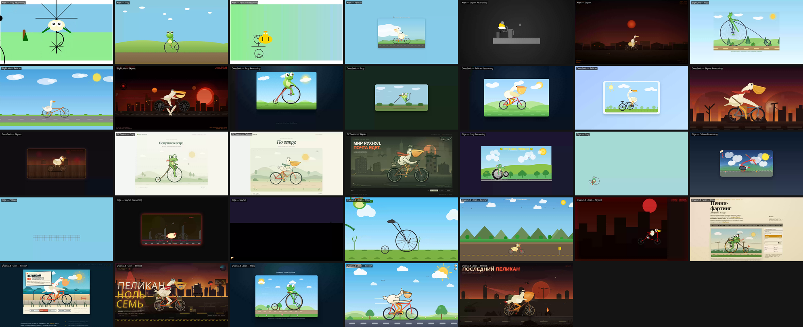](screenshots/overview_grid.png)

[**overview_final.gif**](screenshots/overview_final.gif) — 8 MB, 320×180, ускорение ×3, 3:11 мин.

---

## Исходные промпты

> **Промпт 1 (базовый):**
>
> Напиши одностраничный HTML с SVG-анимацией: мультяшный пеликан (белый\светло-желтый, с большим зобом) едет на велосипеде с радиальными спицами, колеса вращаются, ноги крутят педали, фон смещается назад для имитации движения, чисто на CSS Keyframes, без внешних библиотек

> **Промпт 2 (усложнённый — физика пенни-фартинга):**
>
> Напиши одностраничный HTML с SVG-анимацией: мультяшная лягушка (зеленый\светло-желтый, с большими глазами) едет на велосипеде типа пенни-фартинг с радиальными спицами, колеса вращаются, ноги крутят педали, фон смещается назад для имитации движения, чисто на CSS Keyframes, без внешних библиотек

> **Промпт 3 (постапокалипсис + Скайнет):**
>
> Напиши одностраничный HTML с SVG-анимацией: мультяшный пеликан (белый\светло-желтый, с большим зобом) едет на велосипеде с радиальными спицами, колеса вращаются, ноги крутят педали, фон смещаются назад для имитации движения, чисто на CSS Keyframes, без внешних библиотек. стиль постапокалипсис и война скайнет

---

## Окружение

Локальный инференс выполнялся на **faex FEVM** (архитектура Strix Halo) с **128 ГБ ОЗУ**.

Достаточно легко помещаются две модели одновременно: Qwen 3.8 Flash Next и Qwen 3.6, либо Qwen 3.8 и Qwen 3.8 Flash вместе.

Скорость инференса:
- **Qwen 3.8** — ~10 токенов/с
- **Qwen 3.8 Flash** — ~15 токенов/с (на коротких контекстах — до 20–25 токенов/с)

---

## Воспроизведение эксперимента

Для локального запуска моделей используются следующие команды `llama-server` (ROCm):

### Qwen 3.6-35B (MTP, reasoning)
```bash
/opt/llamacpp/rocm/bin/llama-server \
  --threads 1 --threads-batch 1 --ctx-size 262144 --batch-size 4096 --ubatch-size 1024 \
  --flash-attn auto --cache-type-k q4_0 --cache-type-v q4_0 --gpu-layers 999 --fit off \
  --model /opt/llamacpp/models/Qwen3.6-35B-A3B-MTP-Q8_0.gguf \
  --temp 1 --top-p 0.95 --parallel 2 \
  --mmproj /opt/llamacpp/models/mmproj-F16.gguf \
  --image-min-tokens 8192 --image-max-tokens 8192 \
  --host 0.0.0.0 --port 8501 \
  --spec-type draft-mtp --spec_draft_p_min 0.75 --spec_draft_n_max 4 \
  --cont-batching --jinja --kv_unified \
  --metrics --no-perf --reasoning_preserve
```

### Qwen 3.8-27B (Uncensored, reasoning)
```bash
/opt/llamacpp/rocm/bin/llama-server \
  --threads 1 --threads-batch 2 --ctx-size 262144 --batch-size 4096 --ubatch-size 1024 \
  --flash-attn auto --cache-type-k q4_0 --cache-type-v q4_0 --gpu-layers 999 --fit off \
  --model /opt/llamacpp/models/Qwen3.8-27B-Uncensored-HauhauCS-Aggressive-Q8_K_P.gguf \
  --temp 0.9 --top-p 0.95 --parallel 2 \
  --host 0.0.0.0 --port 8502 \
  --spec-type draft-mtp --spec_draft_p_min 0.75 --spec_draft_n_max 4 \
  --cont-batching --jinja --kv_unified \
  --metrics --no-perf --reasoning_preserve
```

### Qwen 3.8 Flash Next (reasoning)
```bash
/opt/llamacpp/rocm/bin/llama-server \
  --threads 1 --threads-batch 2 --ctx-size 262144 --batch-size 4096 --ubatch-size 1024 \
  --flash-attn auto --cache-type-k q4_0 --cache-type-v q4_0 --gpu-layers 999 --fit off \
  --model /opt/llamacpp/models/UD-IQ4_XS/Qwen3.8-Flash-Next-UD-IQ4_XS-00001-of-00003.gguf \
  --temp 0.9 --top-p 0.95 --parallel 2 \
  --host 0.0.0.0 --port 8503 \
  --spec-type draft-mtp --kv_unified \
  --model-draft /opt/llamacpp/models/MTP/mtp-Qwen3.8-Flash-Next-Q4_K_M.gguf \
  --spec_draft_n_max 4 --spec_draft_p_min 0.75 --cont-batching --metrics --no-perf \
  --reasoning_preserve --jinja
```
---

## Детальные результаты

### 🏆 GPT Astra (2 трлн параметров) — лучший результат

<a href="https://htmlpreview.github.io/?https://github.com/vaimr/pelicans-test/blob/dev/tests/gpt/2026-09-pelican.html" target="_blank">Пеликан</a>

[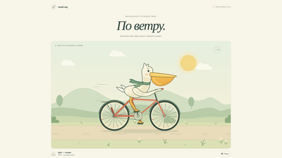](screenshots/gpt/2026-09-pelican.png)

Светлая страница в серых тонах, расслабленная стилизация. Пеликан анимирован, колеса крутятся, лапы на педалях. Фон — облака, холмы и цветы. Работает режим паузы. Генерация ~7 минут.

> Нюансы: ось вращения педалей расположена на уровне ступни, а не педали; сзади велосипеда видна непонятная палочка. Мелочи, легко исправляемые итеративно.

<a href="https://htmlpreview.github.io/?https://github.com/vaimr/pelicans-test/blob/dev/tests/gpt/2026-09-frog.html" target="_blank">Лягушка</a>

[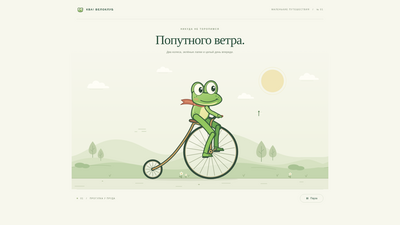](screenshots/gpt/2026-09-frog.png)

Лягушка на пенни-фартинге: правильная анимация ног, колесо вращается, фон меняется. Стилистика продолжается — карта, попутный ветер, ночной режим.

> Ось педалей на уровне ступни — та же мелкая неточность. Механика в целом корректна.

<a href="https://htmlpreview.github.io/?https://github.com/vaimr/pelicans-test/blob/dev/tests/gpt/2026-09-pelican-skynet.html" target="_blank">Пеликан-Скайнет</a>

[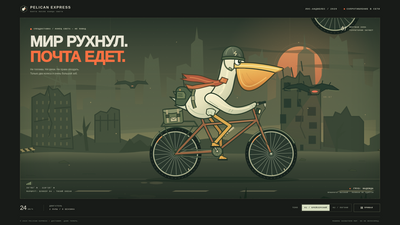](screenshots/gpt/2026-09-pelican-skynet.png)

Настоящий постапокалипсис: пеликан в каске, дроны с моргающими глазами, рюкзак за спиной, колесо вместо облака. Режимы «крейсерский» и «погоня» (ускорение). Появился нибайр.

> Нюансы: ось педалей всё ещё на уровне ступни; цепь на передней звёздочке навешана некорректно; артефакт в раме. В целом — стильно и качественно.

---

### 🤖 DeepSeek — базовый режим

<a href="https://htmlpreview.github.io/?https://github.com/vaimr/pelicans-test/blob/dev/tests/deepseek/2026-09-pelican.html" target="_blank">Пеликан</a>

[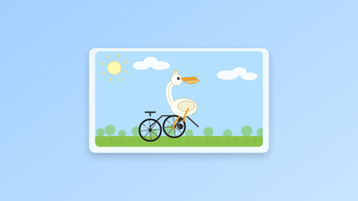](screenshots/deepseek/2026-09-pelican.png)

Неправильно собранный велосипед, моргающее солнышко, дёргающийся фон. Пеликан больше похож на ламу. Попытка имитировать движение ног и педалей есть, но неудачная.

> Результат слабый.

<a href="https://htmlpreview.github.io/?https://github.com/vaimr/pelicans-test/blob/dev/tests/deepseek/2026-09-frog.html" target="_blank">Лягушка</a>

[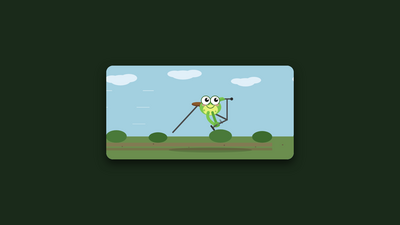](screenshots/deepseek/2026-09-frog.png)

Велосипед не получился, лягушка на лягушку не похожа, рама непропорциональная.

> Результат неудовлетворительный.

<a href="https://htmlpreview.github.io/?https://github.com/vaimr/pelicans-test/blob/dev/tests/deepseek/2026-09-pelican-skynet.html" target="_blank">Пеликан-Скайнет</a>

[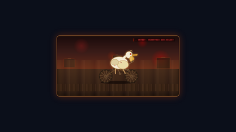](screenshots/deepseek/2026-09-pelican-skynet.png)

Велосипед почти получился, но слишком упрощённый — просто 2 вращающихся колеса и пеликан-терминатор (или цыплёнок-терминатор).

> Результат слабый.

---

### 🤖 DeepSeek — режим рассуждений (reasoning)

<a href="https://htmlpreview.github.io/?https://github.com/vaimr/pelicans-test/blob/dev/tests/deepseek/2026-09-reasoning-pelican.html" target="_blank">Пеликан reasoning</a>

[](screenshots/deepseek/2026-09-reasoning-pelican.png)

Нормальный пеликан на нормальном велосипеде, крутит педали (упрощённо, лапки примитивные). Солнце и фон движутся нормально. Муртяшная стилизация.

> Результат удовлетворительный.

<a href="https://htmlpreview.github.io/?https://github.com/vaimr/pelicans-test/blob/dev/tests/deepseek/2026-09-reasoning-frog.html" target="_blank">Лягушка reasoning</a>

[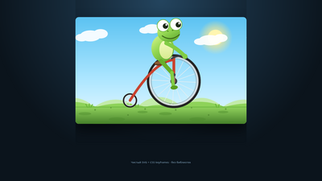](screenshots/deepseek/2026-09-reasoning-frog.png)

Лягушка на велосипеде — велосипед получился правильно, педали упрощённо, лягушка крутит одной ногой. Мультяшно, упрощённо.

> Результат более-менее удовлетворительный.

<a href="https://htmlpreview.github.io/?https://github.com/vaimr/pelicans-test/blob/dev/tests/deepseek/2026-09-reasoning-pelican-skynet.html" target="_blank">Пеликан-Скайнет reasoning</a>

[](screenshots/deepseek/2026-09-reasoning-pelican-skynet.png)

Дроны с красными лампочками, рыбкоподобные элементы. Правильная анимация велосипеда, попытка крутить педалями (упрощённо). Пеликан с шарфиком (как у GPT Astra), но без рюкзака. Очень примитивная рисовка, но более-менее правильная.

> Результат приемлемый для reasoning-режима.

---

### 💻 Qwen 3.6 Local (35B, INT4, Qwen3.6-A3B с MTP)

<a href="https://htmlpreview.github.io/?https://github.com/vaimr/pelicans-test/blob/dev/tests/qwen/3.6-local/2026-09-pelican.html" target="_blank">Пеликан</a>

[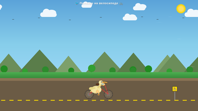](screenshots/qwen/3.6-local/2026-09-pelican.png)

Фон — красивый, с солнышком и птицами. Велосипед пропорциональный. Пеликан в зобе несёт рыбку (интересная идея модели), вода в зобе.

> Результат неудовлетворительный: пеликан не похож на пеликана, цепь не анимирована.

<a href="https://htmlpreview.github.io/?https://github.com/vaimr/pelicans-test/blob/dev/tests/qwen/3.6-local/2026-09-frog.html" target="_blank">Лягушка</a>

[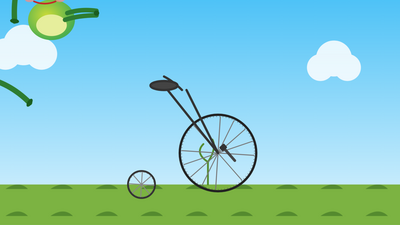](screenshots/qwen/3.6-local/2026-09-frog.png)

Лягушка не получилась — только колёса, без рамы. Лапки «летают» в воздухе.

> Результат абсолютно неудовлетворительный.

<a href="https://htmlpreview.github.io/?https://github.com/vaimr/pelicans-test/blob/dev/tests/qwen/3.6-local/2026-09-pelican-skynet.html" target="_blank">Пеликан-Скайнет</a>

[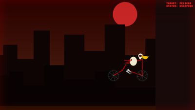](screenshots/qwen/3.6-local/2026-09-pelican-skynet.png)

Терминатор с дыркой в голове, непропорциональный велосипед. Педали крутятся, лапы — не идеально.

> Результат плохой — модель фактически полупрошлого поколения.

---

### 💻 Qwen 3.8 Local (35B, INT4, склонная к рассуждениям)

<a href="https://htmlpreview.github.io/?https://github.com/vaimr/pelicans-test/blob/dev/tests/qwen/3.8-local/2026-09-pelican.html" target="_blank">Пеликан</a>

[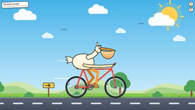](screenshots/qwen/3.8-local/2026-09-pelican.png)

Нормальный пеликан на нормальном велосипеде. **Единственная модель, анимировавшая движение цепи вместе с педалями.** Колёса вращаются, пеликан анимирован, лапы на педалях. Режим старт-стоп, ночной режим. Флажок-гонщик. Пыль сзади, полоски стремительности.

> Уровень хороший для локальной модели. Ось педалей — спорная.

<a href="https://htmlpreview.github.io/?https://github.com/vaimr/pelicans-test/blob/dev/tests/qwen/3.8-local/2026-09-frog.html" target="_blank">Лягушка</a>

[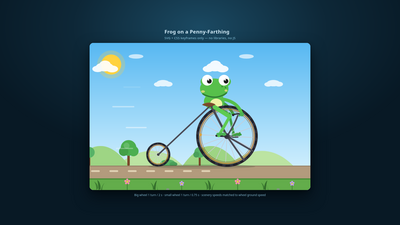](screenshots/qwen/3.8-local/2026-09-frog.png)

Лягушка на пенни-фартинге: педали крутятся, модель выполнила вращение относительно педалей. Фон с деревьями — моргают, появляются внезапно (дорисовка).

> Результат вполне удовлетворительный.

<a href="https://htmlpreview.github.io/?https://github.com/vaimr/pelicans-test/blob/dev/tests/qwen/3.8-local/2026-09-pelican-skynet.html" target="_blank">Пеликан-Скайнет</a>

[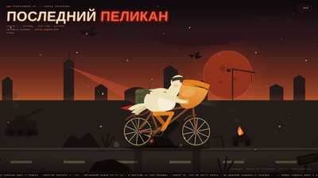](screenshots/qwen/3.8-local/2026-09-pelican-skynet.png)

«Бегущая строка» снизу, дроны, наблюдательная вышка с моргающим лучом. Пеликан-терминатор с нибайром. Ноги/педали анимированы правильно относительно оси педалей.

> Очень неплохой результат для локальной модели 35B, немного не дотягивает до GPT Astra.

---

### 💻 Qwen 3.8 Flash Local (125B, INT4, экстремально быстрая)

<a href="https://htmlpreview.github.io/?https://github.com/vaimr/pelicans-test/blob/dev/tests/qwen/3.8-flash-local/2026-09-pelican.html" target="_blank">Пеликан</a>

[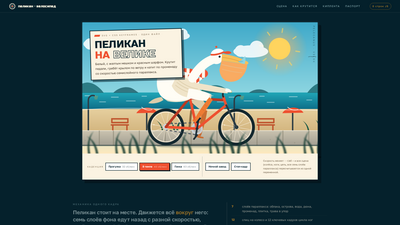](screenshots/qwen/3.8-flash-local/2026-09-pelican.png)

Необычный формат: **полноценная прокручиваемая страница с навигацией**, описаниями и сценами. Пеликан крутит педали (чуть медленнее чем едет). Элементы управления — скорость. Рыбка в зобе (артефакт).

> Цепь движется в обратную сторону — ошибка. Страница — интересная идея.

<a href="https://htmlpreview.github.io/?https://github.com/vaimr/pelicans-test/blob/dev/tests/qwen/3.8-flash-local/2026-09-frog.html" target="_blank">Лягушка</a>

[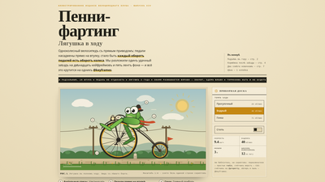](screenshots/qwen/3.8-flash-local/2026-09-frog.png)

Страница в старорусском стиле: «с твердыми знаками», «подъём в гору». Режимы управления, скорость.

> **Единственная модель, понявшая исторический контекст пенни-фартинга** и оформившая страницу соответствующе. Но педали и ноги лягушки крутятся не в ту сторону.

<a href="https://htmlpreview.github.io/?https://github.com/vaimr/pelicans-test/blob/dev/tests/qwen/3.8-flash-local/2026-09-pelican-skynet.html" target="_blank">Пеликан-Скайнет</a>

[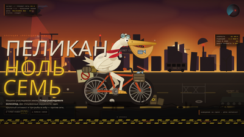](screenshots/qwen/3.8-flash-local/2026-09-pelican-skynet.png)

Стратегия выживания, «4 часа до заката пепла». Пеликан 0.7. Цепь упрощена. Лапы не по оси педалей.

> Целостная картинка, интересная стилизация. Обычная Qwen 3.8 в некоторых моментах чуть лучше, но архитектура Flash ещё тестовая.

---

### 🐦 Alice (Алиса) — режим рассуждений сильно упрощает

<a href="https://htmlpreview.github.io/?https://github.com/vaimr/pelicans-test/blob/dev/tests/alise/2026-09-pelican.html" target="_blank">Пеликан</a>

[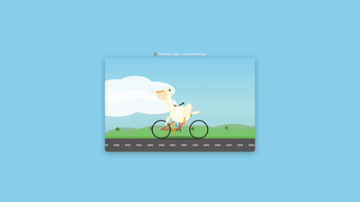](screenshots/alise/2026-09-pelican.png)

Несобранные колеса, пеликан смотрит в обратную сторону, лишь силуэт узнаваем. Дорога и движение — более-менее.

> Результат не очень.

<a href="https://htmlpreview.github.io/?https://github.com/vaimr/pelicans-test/blob/dev/tests/alise/2026-09-frog.html" target="_blank">Лягушка</a>

[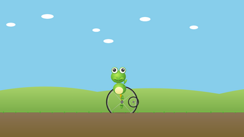](screenshots/alise/2026-09-frog.png)

Велосипед не получился, лягушка сверху, лапы не работают. Фон стал проще — лягушка едет по грязи.

> Результат неудовлетворительный.

<a href="https://htmlpreview.github.io/?https://github.com/vaimr/pelicans-test/blob/dev/tests/alise/2026-09-pelican-skynet.html" target="_blank">Пеликан-Скайнет</a>

[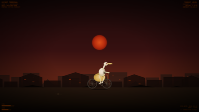](screenshots/alise/2026-09-pelican-skynet.png)

Пеликан-терминатор с красными моргающими глазами и антенной. Цепь спереди — пеликан едет задом наперёд. Пыль от заднего колеса по задумке.

> Результат неудовлетворительный.

<a href="https://htmlpreview.github.io/?https://github.com/vaimr/pelicans-test/blob/dev/tests/alise/2026-09-reasoning-pelican.html" target="_blank">Reasoning: пеликан</a>

[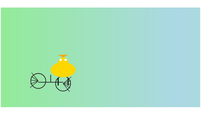](screenshots/alise/2026-09-reasoning-pelican.png)

<a href="https://htmlpreview.github.io/?https://github.com/vaimr/pelicans-test/blob/dev/tests/alise/2026-09-reasoning-frog.html" target="_blank">Reasoning: лягушка</a>

[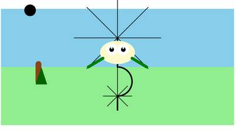](screenshots/alise/2026-09-reasoning-frog.png)

<a href="https://htmlpreview.github.io/?https://github.com/vaimr/pelicans-test/blob/dev/tests/alise/2026-09-reasoning-pelican-skynet.html" target="_blank">Reasoning: пеликан-Скайнет</a>

[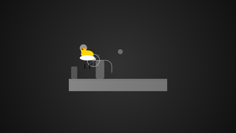](screenshots/alise/2026-09-reasoning-pelican-skynet.png)

**Алиса в режиме рассуждений чрезмерно упрощает задачу.** В чате модель пишет: «ноги считать очень сложно, давай пока удовлетворимся просто прямыми» — ноги двигаются вверх-вниз без привязки к педалям. Пеликан-цыплёнок на облачке вместо постапокалипсиса. Фон моргает, серый.

> Режим рассуждений **ухудшает** результат — модель решает «потом доведем», упрощая прямо сейчас.

---

### 🍆 BigPickle — бесплатно, с лимитом токенов

<a href="https://htmlpreview.github.io/?https://github.com/vaimr/pelicans-test/blob/dev/tests/bigpickle/2026-09-pelican.html" target="_blank">Пеликан</a>

[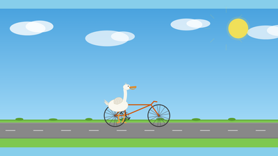](screenshots/bigpickle/2026-09-pelican.png)

Похож на пеликана, велосипед тоже. Но анимация педалей не работает. Солнышко с убегающими лучами, облака движутся.

> Слабоват, но лучше Алисы и Гигачата.

<a href="https://htmlpreview.github.io/?https://github.com/vaimr/pelicans-test/blob/dev/tests/bigpickle/2026-09-frog.html" target="_blank">Лягушка</a>

[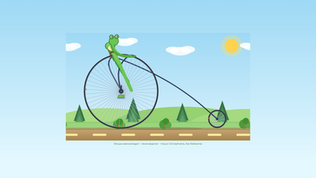](screenshots/bigpickle/2026-09-frog.png)

Велосипед едет задом наперёд. Лягушка с непропорциональными лапами, моргает. Колёса имеют спицы, крутятся в упрощённом виде.

> Результат неудовлетворительный.

<a href="https://htmlpreview.github.io/?https://github.com/vaimr/pelicans-test/blob/dev/tests/bigpickle/2026-09-pelican-skynet.html" target="_blank">Пеликан-Скайнет</a>

[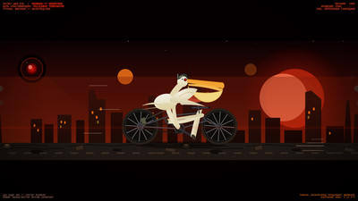](screenshots/bigpickle/2026-09-pelican-skynet.png)

Парапланеры, дроны, глазки-камеры. Кручение педалей не получилось. Пеликан-терминатор в каске, похож на GPT Astra. Дрончики напоминают GPT Astra (возможно, дистилляция).

> Гораздо лучше Гигачата и Алисы, но хуже DeepSeek.

---

### 🤖 GigaChat (Сбербанк) — без рассуждений

<a href="https://htmlpreview.github.io/?https://github.com/vaimr/pelicans-test/blob/dev/tests/giga/2026-09-pelican.html" target="_blank">Пеликан</a>

[](screenshots/giga/2026-09-pelican.png)

Сетка движется, тень. Без рассуждений — не справился.

> Результат неудовлетворительный.

<a href="https://htmlpreview.github.io/?https://github.com/vaimr/pelicans-test/blob/dev/tests/giga/2026-09-frog.html" target="_blank">Лягушка</a>

[](screenshots/giga/2026-09-frog.png)

Лягушка в углу, машет непонятно чем. Велосипед не получился. Колесо крутится.

> Результат неудовлетворительный.

<a href="https://htmlpreview.github.io/?https://github.com/vaimr/pelicans-test/blob/dev/tests/giga/2026-09-pelican-skynet.html" target="_blank">Пеликан-Скайнет</a>

[](screenshots/giga/2026-09-pelican-skynet.png)

Движущийся элемент внизу, пробегает что-то похожее на паука. Вдалеке — отголоски взрыва.

> Результат не очень.

### GigaChat — с рассуждениями

<a href="https://htmlpreview.github.io/?https://github.com/vaimr/pelicans-test/blob/dev/tests/giga/2026-09-reasoning-pelican.html" target="_blank">Reasoning: пеликан</a>

[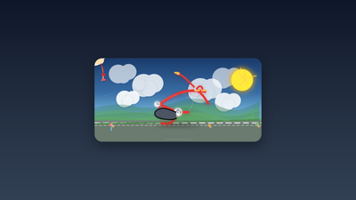](screenshots/giga/2026-09-reasoning-pelican.png)

<a href="https://htmlpreview.github.io/?https://github.com/vaimr/pelicans-test/blob/dev/tests/giga/2026-09-pelican.html" target="_blank">Пеликан из SVG</a> — в HTML-файле спрятан SVG с изображением пеликана, но на странице не отображается. 

[Полноразмерный скриншот](screenshots/giga/2026-09-pelican-pic.png)

<a href="https://htmlpreview.github.io/?https://github.com/vaimr/pelicans-test/blob/dev/tests/giga/2026-09-reasoning-frog.html" target="_blank">Reasoning: лягушка</a>

[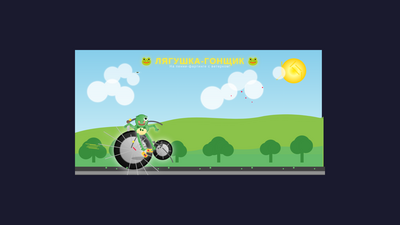](screenshots/giga/2026-09-reasoning-frog.png)

<a href="https://htmlpreview.github.io/?https://github.com/vaimr/pelicans-test/blob/dev/tests/giga/2026-09-reasoning-pelican-skynet.html" target="_blank">Reasoning: пеликан-Скайнет</a>

[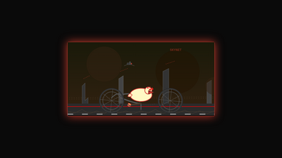](screenshots/giga/2026-09-reasoning-pelican-skynet.png)

В режиме рассуждений GigaChat показывает небольшие улучшения. В reasoning-пеликане — уже есть фон и движение, но велосипед не узнаваем. В reasoning-лягушке — «лягушка-гонщик», но велосипед больше похож на каток. В reasoning-Скайнете — колёса, фон с дронами (с красными лампочками).

> Всё равно неудовлетворительно. GigaChat не показывает свои рассуждения.

---

## Общий обзор

### Сравнение моделей

| Модель | Пеликан | Лягушка | Скайнет | Reasoning |
|--------|---------|---------|---------|-----------|
| **GPT Astra** (2T) | ✅ Отлично | ✅ Хорошо | ✅ Отлично | — |
| **DeepSeek** | ✅ Хорошо | ✅ Хорошо | ✅ Хорошо | ✅ Улучшает |
| **Qwen 3.8** (35B) | ✅ Хорошо | ✅ Хорошо | ✅ Хорошо | — |
| **Qwen 3.8 Flash** (125B) | ⚠️ Средне | ⚠️ Средне | ⚠️ Средне | — |
| **Qwen 3.6** (35B) | ❌ Плохо | ❌ Плохо | ❌ Плохо | N/A |
| **BigPickle** | ⚠️ Слабо | ❌ Плохо | ⚠️ Слабо | N/A |
| **Alice** | ❌ Плохо | ❌ Плохо | ❌ Плохо | ❌ Ухудшает |
| **GigaChat** | ❌ Плохо | ❌ Плохо | ❌ Плохо | ⚠️ Чуть лучше |

---

---

## Выводы

1. **Модели-фронтьер (GPT Astra) опережают остальные модели.** Российские модели (Alice, GigaChat) значительно отстают — на уровне прошлых поколений (~10–12 месяцев). DeepSeek показывает результаты на уровне недавних топов.

2. **Локально развёрнутые Qwen 3.8 (35B) показывают отличные результаты.** Им уже можно смело пользоваться с высоким качеством. Они работают медленнее (но для генерации файлов это приемлемо).

3. **Qwen 3.8 Flash (125B)** — новая архитектура, результаты перспективные, но пока чуть уступает обычной Qwen 3.8 в некоторых нюансах.

4. **Мультимодальность — ключевой фактор.** Возможность модели посмотреть на сгенерированный результат (скриншот → итерация) радикально улучшает итог. Даже Qwen 3.6 за несколько итераций добьётся нормального кручения педалей. Чем качественнее первый результат — тем проще доводить.

5. **Режим рассуждений работает по-разному.** У Qwen 3.8 — даёт глубокий анализ (но генерация длится от 1 ч 40 мин до 2 ч 40 мин). У Alice — **ухудшает**: модель решает «всё упростить и довести потом», что приводит к катастрофическим упрощениям. DeepSeek в reasoning-режиме показывает стабильные результаты.

6. **Агентский цикл на скромном железе.** Qwen 3.8 — для верификации/планирования, Qwen 3.6 — как исполнитель. В агентском цикле с многократными итерациями можно добиваться схожих результатов на относительно скромном оборудовании.

---

## Структура файлов эксперимента

```
tests/
├── gpt/                    # GPT Astra (2 трлн)
│   ├── 2026-09-pelican.html
│   ├── 2026-09-frog.html
│   └── 2026-09-pelican-skynet.html
├── deepseek/               # DeepSeek (с reasoning)
│   ├── 2026-09-pelican.html
│   ├── 2026-09-frog.html
│   ├── 2026-09-pelican-skynet.html
│   ├── 2026-09-reasoning-pelican.html
│   ├── 2026-09-reasoning-frog.html
│   └── 2026-09-reasoning-pelican-skynet.html
├── qwen/
│   ├── 3.6-local/          # Qwen 3.6-A3B, 35B, INT4, MTP
│   │   ├── 2026-09-pelican.html
│   │   ├── 2026-09-frog.html
│   │   └── 2026-09-pelican-skynet.html
│   ├── 3.8-local/          # Qwen 3.8, 35B, INT4, MTP
│   │   ├── 2026-09-pelican.html
│   │   ├── 2026-09-frog.html
│   │   └── 2026-09-pelican-skynet.html
│   └── 3.8-flash-local/    # Qwen 3.8 Flash, 125B, INT4, MTP
│       ├── 2026-09-pelican.html
│       ├── 2026-09-frog.html
│       └── 2026-09-pelican-skynet.html
├── alise/                  # Alice (с reasoning)
│   ├── 2026-09-pelican.html
│   ├── 2026-09-frog.html
│   ├── 2026-09-pelican-skynet.html
│   ├── 2026-09-reasoning-pelican.html
│   ├── 2026-09-reasoning-frog.html
│   └── 2026-09-reasoning-pelican-skynet.html
├── bigpickle/              # BigPickle (бесплатно, с лимитом)
│   ├── 2026-09-pelican.html
│   ├── 2026-09-frog.html
│   └── 2026-09-pelican-skynet.html
    └── giga/                   # GigaChat (Сбер, с reasoning)
        ├── 2026-09-pelican.html
        ├── 2026-09-pelican-pic.png
        ├── 2026-09-frog.html
        ├── 2026-09-pelican-skynet.html
        ├── 2026-09-reasoning-pelican.html
        ├── 2026-09-reasoning-frog.html
        └── 2026-09-reasoning-pelican-skynet.html

screenshots/              # Скриншоты (1920×1080)
├── overview.gif          # Анимированная презентация всех моделей
├── overview.mp4          # Видео-презентация
├── thumbnails/           # Превью-скриншоты (400×225)
│   ├── gpt/
│   ├── deepseek/
│   ├── qwen/
│   ├── alise/
│   ├── bigpickle/
│   └── giga/
├── gpt/                  # Скриншоты GPT Astra
│   ├── 2026-09-pelican.png
│   ├── 2026-09-pelican-skynet.png
│   └── 2026-09-frog.png
├── deepseek/             # Скриншоты DeepSeek
│   ├── 2026-09-pelican.png
│   ├── 2026-09-pelican-skynet.png
│   ├── 2026-09-frog.png
│   ├── 2026-09-reasoning-pelican.png
│   ├── 2026-09-reasoning-pelican-skynet.png
│   └── 2026-09-reasoning-frog.png
├── qwen/                 # Скриншоты Qwen
│   ├── 3.6-local/
│   │   ├── 2026-09-pelican.png
│   │   ├── 2026-09-pelican-skynet.png
│   │   └── 2026-09-frog.png
│   ├── 3.8-local/
│   │   ├── 2026-09-pelican.png
│   │   ├── 2026-09-pelican-skynet.png
│   │   └── 2026-09-frog.png
│   └── 3.8-flash-local/
│       ├── 2026-09-pelican.png
│       ├── 2026-09-pelican-skynet.png
│       └── 2026-09-frog.png
├── alise/                # Скриншоты Alice
│   ├── 2026-09-pelican.png
│   ├── 2026-09-pelican-skynet.png
│   ├── 2026-09-frog.png
│   ├── 2026-09-reasoning-pelican.png
│   ├── 2026-09-reasoning-pelican-skynet.png
│   └── 2026-09-reasoning-frog.png
├── bigpickle/            # Скриншоты BigPickle
│   ├── 2026-09-pelican.png
│   ├── 2026-09-pelican-skynet.png
│   └── 2026-09-frog.png
└── giga/                 # Скриншоты GigaChat
    ├── 2026-09-pelican.png
    ├── 2026-09-pelican-skynet.png
    ├── 2026-09-frog.png
    ├── 2026-09-pelican-pic.png
    ├── 2026-09-reasoning-pelican.png
    ├── 2026-09-reasoning-pelican-skynet.png
    └── 2026-09-reasoning-frog.png
```
